# Decoding PWM signals from a 3-channel radio receiver
## Or how to hijack a remote control car with a microcontroller

<br>

**Table of content**
1. Summary
2. Introduction
3. System architecture
4. Understanding PWM and Interrupts
5. First example: Measuring a single PWM signal
6. Diving deeper into timing challenges
7. Next steps towards more accurate readings
8. Putting it all together


## Summary

This post explains how to decode PWM signals from a 3-channel RC receiver using interrupts on an Arduino Mega. By inserting a microcontroller between the receiver and the actuators, I created a basic man-in-the-middle controller capable of switching between manual control and autonomous commands. This forms a key part of the control architecture of a larger project focused on retrofitting an RC car into an autonomous racing vehicle. 

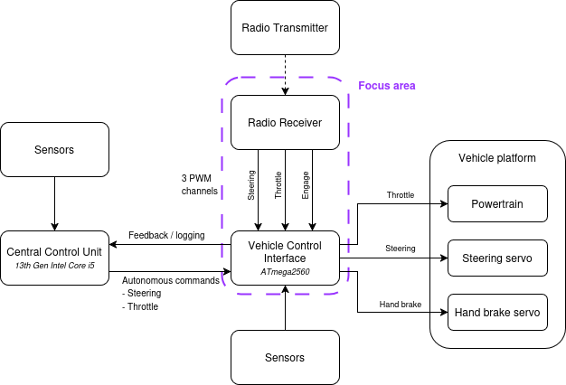{:style="width: 500px; height: auto; display: block; margin: 0 auto;"}
<p style="text-align: center; font-size: 0.9em; color: #555;">Image 1: Simplified system diagram and focus area</p>

## Introduction

Remote-controlled cars typically use PWM signals from a radio receiver to drive motors and servos — providing manual control over throttle, steering, and auxiliary functions. In this project, I wanted to insert a microcontroller into that signal path to act as a gatekeeper. The goal was to allow an external autonomy computer to take control of the vehicle when needed, while still preserving manual control from the RC transmitter when desired.
This blog post details how I used interrupts on an Arduino Mega to reliably read multiple PWM channels, enabling the system to detect inputs from both sources and switch between autonomous and manual modes in real time. Along the way, I’ll walk through some of the challenges I encountered — including timing precision, signal jitter, and reliable mode switching — and the engineering decisions I made to work around them.


## System architecture

This section outlines the key hardware and software components involved in this part of the project, along with their roles and interactions. To keep the focus clear and manageable, I’ll be limiting the discussion to the elements highlighted in the purple box — representing the specific scope of this post.

The Vehicle Control Interface is the low level brain of the system. It is composed of an ArduinoMega, built around the ATmega2560 microcontroller, offering 54 digital I/O pins, 16 analog inputs and multiple hardware serial ports.  It is completed by a custom designed Printed Circuit Board (PCB), which provides cleaner and more reliable wiring connections. 
The Radio Receiver is a 6-channel SR6110AT DSMR AVC telemetry receiver, operating over the 2404-2476 Mhz frequency range with the transmitter. Each of the six channels outputs a standard PWM signal, commonly used to control servos and ESCs (Electronic Speed Controller) in RC systems. 

As part of this project I will be focusing only on three channels out of six of the receiver:
- Channel 2 carries the steering command with a PWM signal at around 181 Hz (period 5.5 ms)
- Channel 3 carries the throttle command with a PWM signal at around 90 Hz (period 11ms)
- Channel 5 carries a button engage state (used to switch between autonomous and manual control) with a PWM signal at around 181 Hz (period 5.5 ms)

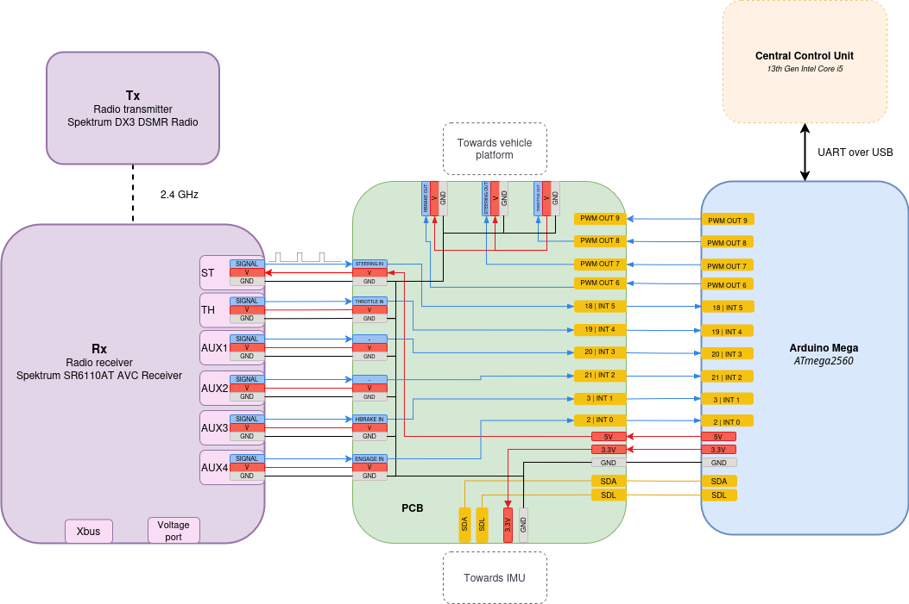{:style="width: 700px; height: auto; display: block; margin: 0 auto;"}
<p style="text-align: center; font-size: 0.9em; color: #555;">Image 2: Wiring diagram</p>

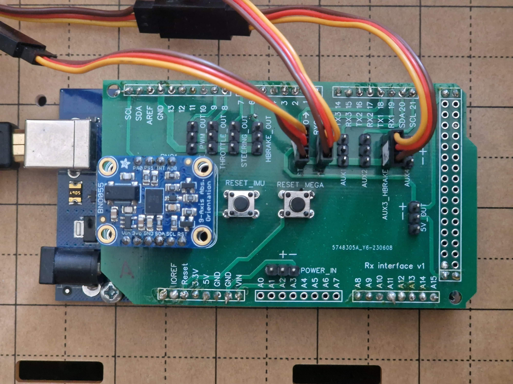{:style="width: 300px; height: auto; display: block; margin: 0 auto;"}
<p style="text-align: center; font-size: 0.9em; color: #555;">Image 3: Printed Circuit Board</p>

## Understanding PWM and Interrupts

The goal of the Vehicle Control Interface is to process the three incoming PWM (Pulse Width Modulation) signals and extract the control information they carry. A PWM signal is a digital signal that alternates between HIGH and LOW voltage states. While the frequency remains constant, the duration of the HIGH state—known as the pulse width—varies. This variation encodes the transmitted signal, which in our case corresponds to steering, throttle, or an engagement request.

To accurately measure PWM signals, we use interrupt pins, which allow the microcontroller to respond immediately when a signal changes state. Instead of constantly checking the pin’s value in a loop, interrupts trigger an Interrupt Service Routine (ISR) - a special function that runs as soon as a rising or falling edge is detected. This enables precise timing measurements of the PWM signal’s HIGH and LOW durations, which is essential for decoding the information carried by the signal. 

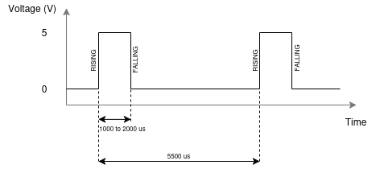{:style="width: 400px; height: auto; display: block; margin: 0 auto;"}
<p style="text-align: center; font-size: 0.9em; color: #555;">Image 4: PWM signal</p>


## First example: Measuring a single PWM signal

To illustrate this approach, consider the following example that captures the width of a PWM signal on the steering channel using an interrupt service routine.

```cpp
// Variables used to store the timestamp of the rising edge and the calculated pulse width
volatile unsigned long pulseStart = 0;
volatile unsigned long pulseWidth = 0;

// Pin connected to PWM signal. On the ArduinoMega, Pin 18 is interrupt 5
const int interrupt_pin = 18;

void setup() {
  Serial.begin(9600); // Initialize serial communication for debugging
  pinMode(interrupt_pin, INPUT); // Set the interrupt pin as an input

  // Attach an interrupt to the pin, triggering on both RISING and FALLING edges
  attachInterrupt(digitalPinToInterrupt(interrupt_pin), InterruptServiceRoutine, CHANGE); 
}

void InterruptServiceRoutine() {
  // Check if the signal just went HIGH (rising edge)
  if (digitalRead(interrupt_pin) == HIGH) {
    pulseStart = micros();  // Record timestamp of rising edge
  } else {
    // If the signal just went LOW (falling edge), calculate the pulse width
    pulseWidth = micros() - pulseStart;
  }
}

void loop() {

 static unsigned long lastRun = 0;

 // Print the pulse every 50 milliseconds
  if (millis() - lastRun >= 50)
  {
    lastRun = millis(); // Update the last run time

    // Output to serial monitor
    Serial.print("Pulse width: ");
    Serial.print(pulseWidth);
    Serial.println(" us"); 
  }
}
```
<p style="text-align: center; font-size: 0.9em; color: #555;">Code example 1: Measure PWM HIGH width</p>

If we plot the pulseWidth on a graph, this is what we obtain. In this example I have been turning the steering wheel left and right continuously. And we see the pulseWidth oscillate accordingly between 1200 us and 1900 us. 

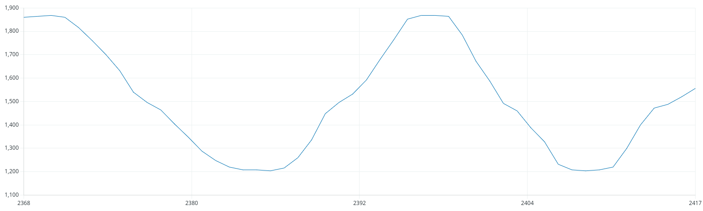{:style="width: 500px; height: auto; display: block; margin: 0 auto;"}
<p style="text-align: center; font-size: 0.9em; color: #555;">Image 5: Steering pulsewidth from code example 1</p>

This seems to be right what we were trying to achieve. But what if we look a little closer, when the steering is constant for example. 

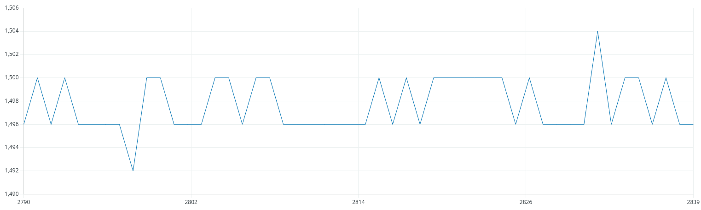{:style="width: 500px; height: auto; display: block; margin: 0 auto;"}
<p style="text-align: center; font-size: 0.9em; color: #555;">Image 6: Steering pulsewidth stabilized</p>

In the above plot, we can see that the measured pulse width for the steering channel typically fluctuates between 1496 us and 1500 us, but occasionally dips to 1492 us or spikes to 1504 us. 
At first glance, these small jumps might seem like random noise, but they reveal some deeper insights about how PWM signals behave in embedded systems. Understanding these fluctuations helps identify the inherent limits of the hardware and timing mechanisms, enabling improvements in performance. Here are a few key observations:


**The input PWM signal exhibits slight variability**, which is expected due to inherent noise in the system. This noise can arise from several sources, including imperfections in the transmitter’s steering sensor, the wireless transmission process, and electrical noise along the wiring.

**The Arduino’s micros() function has a 4 us resolution**, which means that small timing noise will show up as a +/- 4 us variation. 

**Interrupt latency and timing jitter can cause inconsistent capture times**, especially if other interrupts or serial printing are happening concurrently.

## Diving deeper into timing challenges

While the pulse width measurements provided a useful introduction, they only reveal part of the story. To better understand the challenges involved in decoding PWM signals reliably, especially under more demanding conditions (e.g., multiple channels, system load, or tight timing constraints), we need to zoom out and examine the full signal — including its frequency and consistency over time.
Measuring the complete signal period allows us to observe more subtle timing inconsistencies. While pulse width captures just the HIGH duration, full-cycle timing reflects the entire signal behavior and amplifies any irregularities caused by system latency or jitter.


Measuring the entire PWM signal period requires a slight modification to the earlier setup. Below is a straightforward example demonstrating this:

```cpp
// Variables used to store the timestamp of the rising edge and the calculated period
volatile unsigned long lastRiseTime = 0;
volatile unsigned long period = 0;

// Pin connected to PWM signal. On the ArduinoMega, Pin 18 is interrupt 5
const int interrupt_pin = 18; // Pin 18 is interrupt 5


void setup(){
   Serial.begin(9600); // Initialize serial communication for debugging
   pinMode(interrupt_pin, INPUT); // Set the interrupt pin as an input

   // Attach an interrupt to the pin, triggering on the RISING edge only
   attachInterrupt(digitalPinToInterrupt(interrupt_pin), InterruptServiceRoutine, RISING);
}


void InterruptServiceRoutine() {
   // Capture the current time in microseconds
   unsigned long currentTime = micros();

   // Calculate the time elapsed since the last rising edge (i.e., the period of the signal)
   period = currentTime - lastRiseTime;

   // Update the last rise time for the next calculation
   lastRiseTime = currentTime;
}


void loop() {
   static unsigned long lastRun = 0;
  
   // Print the pulse every 50 milliseconds
   if (millis() - lastRun >= 50)
   {
       lastRun = millis(); // Update the last run time

       // Output to serial monitor
       Serial.print("Period: ");
       Serial.print(period);
       Serial.println(" us");
   }
}
```
<p style="text-align: center; font-size: 0.9em; color: #555;">Code example 2: Measure PWM full period</p>


This is what the measured signal period looks overtime. 

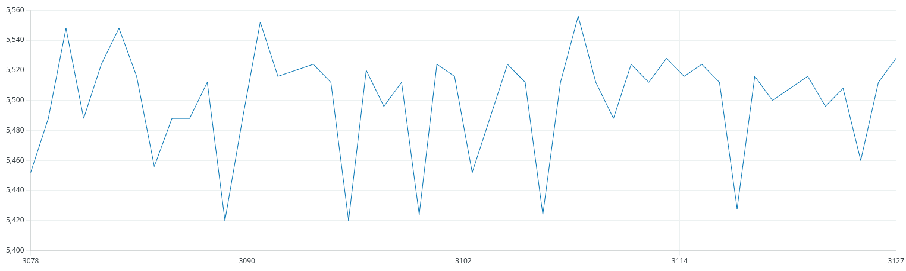{:style="width: 500px; height: auto; display: block; margin: 0 auto;"}
<p style="text-align: center; font-size: 0.9em; color: #555;">Image 7: PulseWidth of entire PWM signal</p>

In the plot above, the measured period for the steering channel generally varies between 5420 µs and 5470 µs. This represents significantly greater fluctuation compared to the narrower variation observed when measuring only the pulse width during the HIGH voltage state.

Before diving deeper into how to improve signal measurement, it’s important to step back and look at the complete path a PWM signal takes — from the user’s physical input on the transmitter to the final measurement on the microcontroller. At each stage along this path, small variations and delays can be introduced due to mechanical imperfections, electronic components, wireless communication, and software timing limitations. These subtle sources of noise accumulate, and understanding where they originate is key to interpreting the measured data accurately and designing more robust systems. The diagram below outlines this end-to-end signal chain and highlights the main contributors to signal variability.

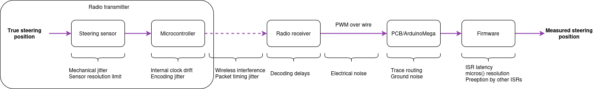{:style="width: 600px; height: auto; display: block; margin: 0 auto;"}
<p style="text-align: center; font-size: 0.9em; color: #555;">Image 8: Signal propagation and sources of noise and latency</p>

Additionally, to better understand potential sources of software-level noise and latency, I’ll refer to the diagram below for illustration.

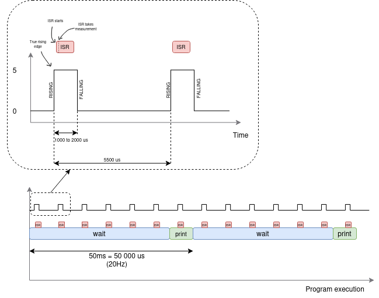{:style="width: 500px; height: auto; display: block; margin: 0 auto;"}
<p style="text-align: center; font-size: 0.9em; color: #555;">Image 9: Program execution</p>

A few key observations from the diagram above:

The program is designed to report the measured value every 50 milliseconds, ensuring feedback from the low-level controller is provided at a consistent rate. However, the PWM signal being measured operates at a much higher frequency—roughly ten times faster. While the main loop runs at this slower pace, the Interrupt Service Routine (ISR) continues to trigger on every pulse edge. As a result, **for each pass through the main loop, about ten ISR calls occur, yet only the most recent measurement is used**. This means valuable intermediate data is discarded—information that could potentially help reduce measurement noise if captured and processed.

Each ISR pauses the main program while it executes. If two PWM signals experience a rising edge close together in time, the first interrupt to trigger will run its ISR and momentarily prevent the second one from executing. As a result, the timing measurement for the second signal may be slightly delayed.

When the main program attempts to read the period, an ISR could be triggered simultaneously due to a new PWM edge. Since ISRs can update shared variables asynchronously, this may lead to a race condition where the main loop reads a partially updated value, resulting in incorrect or inconsistent data. 

## Next steps towards more accurate readings

Now that we've explored the sources of variability and the challenges involved in measuring PWM signals accurately, it's time to consider how we might improve our system. While some noise is inevitable, there are several techniques that can significantly reduce its impact, improve measurement stability, and make the system more robust. Below are some practical strategies and design patterns that can be implemented to enhance performance and reliability.


1. Optimize Interrupt Service Routines: ISRs need to be kept as short as possible to minimize blocking other processes and reduce latency. 
2. Disable interrupts during critical sections: Temporarily block interrupts when reading shared data to avoid race conditions. 
3. Average multiple measurements: Collect several pulse widths and calculate an average to smooth out noise and jitter.
4. Prioritize critical ISRs: Assign higher priority ISRs to time-sensitive interrupts to capture more accurate timing information to the most important channels. 
5. Implement software debouncing or filtering algorithms: Smooth out the signal readings by applying low pass or Hysteresis filters.

To address some of the issues discussed above, I’ve implemented a revised version of the code that incorporates a few key improvements to produce more stable and accurate measurements.

```cpp
// Variables used to store the timestamp of the rising edge and the calculated period
volatile unsigned long lastRiseTime = 0;
volatile unsigned long period = 0;

// Variables for averaging
volatile unsigned long periodSum = 0;
volatile unsigned int periodCount = 0;

// Pin connected to PWM signal. On the ArduinoMega, Pin 18 is interrupt 5
const int interrupt_pin = 18; // Pin 18 is interrupt 5


void setup(){
   Serial.begin(9600); // Initialize serial communication for debugging
   pinMode(interrupt_pin, INPUT); // Set the interrupt pin as an input

   // Attach an interrupt to the pin, triggering on the RISING edge only
   attachInterrupt(digitalPinToInterrupt(interrupt_pin), InterruptServiceRoutine, RISING);
}


void InterruptServiceRoutine() {
   // Capture the current time in microseconds
   unsigned long currentTime = micros();

   // Calculate the time elapsed since the last rising edge (i.e., the period of the signal)
   period = currentTime - lastRiseTime;

   // Update the last rise time for the next calculation
   lastRiseTime = currentTime;

   // Accumulate period for averaging
   periodSum += period;
   periodCount++;
}


void loop() {
   static unsigned long lastRun = 0;
  
   // Print the pulse every 50 milliseconds
   if (millis() - lastRun >= 50)
   {
     noInterrupts();

     unsigned long averagePeriod = 0;
     if (periodCount > 0){
       averagePeriod = periodSum / periodCount;
     }

     // Reset for next averaging period
     periodSum = 0;
     periodCount = 0;
     interrupts();

     lastRun = millis(); // Update the last run time

     // Output to serial monitor
     // Serial.print("Period: ");
    
     Serial.println(averagePeriod);
     // Serial.println(" us");
   }
}
```
<p style="text-align: center; font-size: 0.9em; color: #555;">Code example 3: Optimized PWM 1-channel reading</p>

This is what the measured signal period looks overtime. 

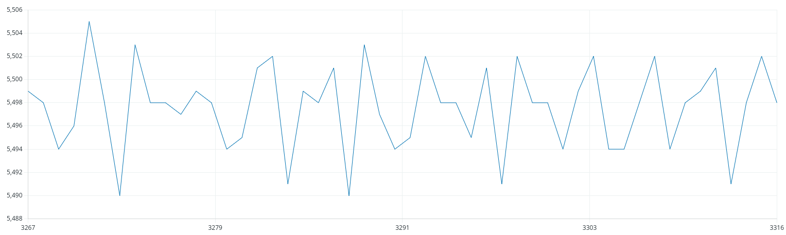{:style="width: 500px; height: auto; display: block; margin: 0 auto;"}
<p style="text-align: center; font-size: 0.9em; color: #555;">Image 10: Pulsewidth reading with example 3</p>

In the plot above, the measured period for the steering channel remains fairly consistent, typically ranging from 5490 µs to 5504 µs. This indicates a much tighter clustering of values and significantly reduced fluctuation compared to previous measurement methods. The improvement suggests that the recent changes have helped mitigate timing noise and jitter. As a result, the signal's behavior appears more stable and accurate, bringing the measurements closer to the true characteristics of the input PWM signal.

## Putting it all together

After experimenting with individual PWM signal readings and understanding how to work with interrupts and timers, I’ve taken all the learnings from earlier sections and combined them into a finalized version of the code. This version reads multiple PWM inputs using interrupts and records the pulse widths accurately and efficiently. By structuring the code to handle all the signals together, the setup is now more robust, synchronized, and easier to expand or adapt for more complex applications.

```cpp
// Variables for averaging
volatile unsigned long steeringHighTimeSum = 0;
volatile unsigned int steeringHighTimeCount = 0;

volatile unsigned long throttleHighTimeSum = 0;
volatile unsigned int throttleHighTimeCount = 0;

volatile unsigned long engageHighTimeSum = 0;
volatile unsigned int engageHighTimeCount = 0;

unsigned long steeringRiseTime = 0;
unsigned long throttleRiseTime = 0;
unsigned long engageRiseTime = 0;

// Pin connected to PWM signal. On the ArduinoMega, Pin 18 is interrupt 5
const int steering_interrupt_pin = 18; // Pin 18 is interrupt 5
const int throttle_interrupt_pin = 19; // Pin 19 is interrupt 4
const int engage_interrupt_pin = 3; // Pin 3 is interrupt 1


void setup(){
 Serial.begin(9600); // Initialize serial communication for debugging

 // Set all interrupt pins as inputs
 pinMode(steering_interrupt_pin, INPUT);
 pinMode(throttle_interrupt_pin, INPUT);
 pinMode(engage_interrupt_pin, INPUT);

 // Attach an interrupt to teach pin
 attachInterrupt(digitalPinToInterrupt(steering_interrupt_pin), SteeringInterruptServiceRoutine, CHANGE);
 attachInterrupt(digitalPinToInterrupt(throttle_interrupt_pin), ThrottleInterruptServiceRoutine, CHANGE);
 attachInterrupt(digitalPinToInterrupt(engage_interrupt_pin), EngageInterruptServiceRoutine, CHANGE);
}


void SteeringInterruptServiceRoutine() {

 unsigned long now = micros();
 bool currentState = digitalRead(steering_interrupt_pin);

 if (currentState == HIGH){
   // Rising edge: store the timestamp
   steeringRiseTime = now;
 } else{
   // Falling edge: compute time spent HIGH
   unsigned long duration = now - steeringRiseTime;

   // Could potentially ignore pulses shorter than x or larger than y

   steeringHighTimeSum += duration;
   steeringHighTimeCount++;
 }
}

void ThrottleInterruptServiceRoutine(){
 unsigned long now = micros();
 bool currentState = digitalRead(throttle_interrupt_pin);

 if (currentState == HIGH){
   // Rising edge: store the timestamp
   throttleRiseTime = now;
 } else{
   // Falling edge: compute time spent HIGH
   unsigned long duration = now - throttleRiseTime;

   // Could potentially ignore pulses shorter than x or larger than y

   throttleHighTimeSum += duration;
   throttleHighTimeCount++;
 }
}

void EngageInterruptServiceRoutine(){
 unsigned long now = micros();
 bool currentState = digitalRead(engage_interrupt_pin);

 if (currentState == HIGH){
   // Rising edge: store the timestamp
   engageRiseTime = now;
 } else{
   // Falling edge: compute time spent HIGH
   unsigned long duration = now - engageRiseTime;

   // Could potentially ignore pulses shorter than x or larger than y

   engageHighTimeSum += duration;
   engageHighTimeCount++;
 }
}


void loop() {
 static unsigned long lastRun = 0;

 // Print the pulse every 50 milliseconds
 if (millis() - lastRun >= 50)
 {
   noInterrupts();

   unsigned long steeringAverageHighTime = 0;
   if (steeringHighTimeCount > 0){
     steeringAverageHighTime = steeringHighTimeSum / steeringHighTimeCount;
   }

   unsigned long throttleAverageHighTime = 0;
   if (throttleHighTimeCount > 0){
     throttleAverageHighTime = throttleHighTimeSum / throttleHighTimeCount;
   }

   unsigned long engageAverageHighTime = 0;
   if (engageHighTimeCount > 0){
     engageAverageHighTime = engageHighTimeSum / engageHighTimeCount;
   }

   // Reset for next averaging period
   steeringHighTimeSum = 0;
   steeringHighTimeCount = 0;
   throttleHighTimeSum = 0;
   throttleHighTimeCount = 0;
   engageHighTimeSum = 0;
   engageHighTimeCount = 0;

   interrupts();

   lastRun = millis(); // Update the last run time
    Serial.print(steeringAverageHighTime);
   Serial.print(",");
   Serial.print(throttleAverageHighTime);
   Serial.print(",");
   Serial.println(engageAverageHighTime);
 }
}
```
<p style="text-align: center; font-size: 0.9em; color: #555;">Code example 4: 3 Channel PWM reading</p>

The plot below illustrates how the HIGH pulse width of each channel changes over time. The signals appear stable overall, and I manually interacted with the controls—moving the steering, pressing the throttle, and toggling the engage button—during the recording. However, there is some residual noise present, which we will analyze in more detail below.

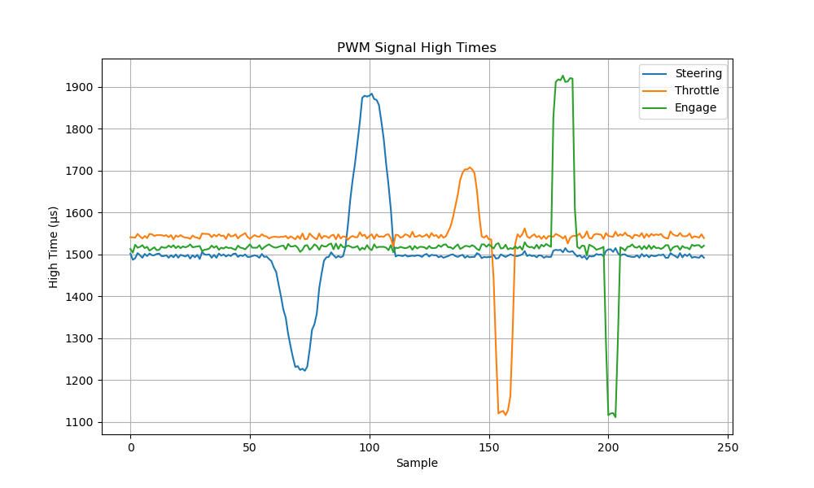{:style="width: 500px; height: auto; display: block; margin: 0 auto;"}
<p style="text-align: center; font-size: 0.9em; color: #555;">Image 11: 3 channels PWM signals over time</p>


The two graphs below show us the evolution of the three values without any manual inputs and their distribution.


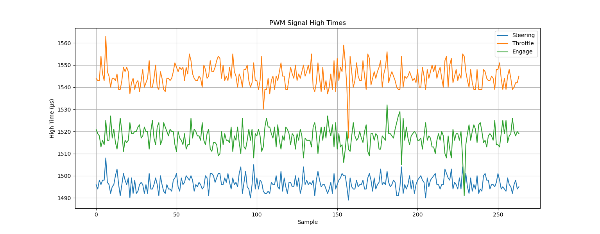{:style="width: 800px; height: auto; display: block; margin: 0 auto;"}
<p style="text-align: center; font-size: 0.9em; color: #555;">Image 12: 3 channels PWM signals over time without manual input</p>

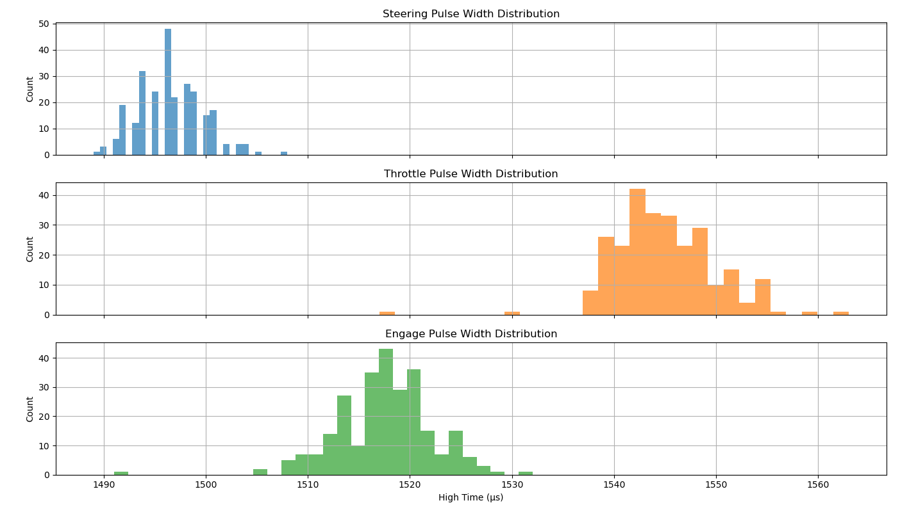{:style="width: 600px; height: auto; display: block; margin: 0 auto;"}
<p style="text-align: center; font-size: 0.9em; color: #555;">Image 13: 3 channels PWM signals distribution</p>

The three distributions appear significantly wider compared to when we measured just a single PWM signal. To better illustrate this difference, I plotted below the results obtained by reading only the steering channel. This was done using the same program as before, with the two other interrupt service routines simply disabled.

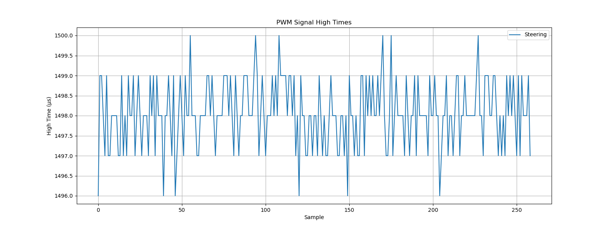{:style="width: 800px; height: auto; display: block; margin: 0 auto;"}
<p style="text-align: center; font-size: 0.9em; color: #555;">Image 14: Steering channel only PWM evolution</p>

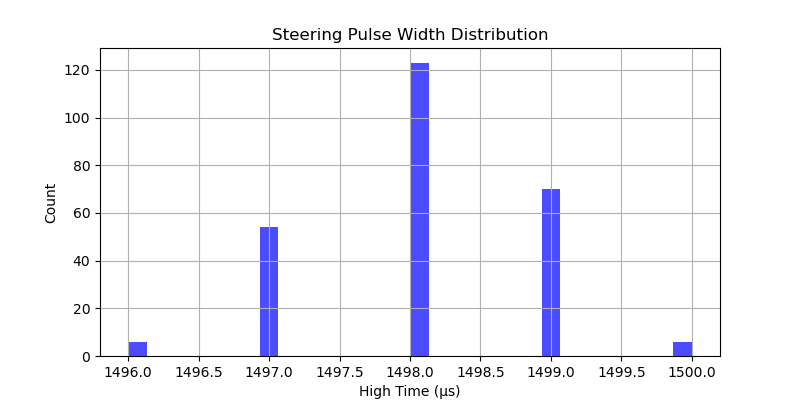{:style="width: 800px; height: auto; display: block; margin: 0 auto;"}
<p style="text-align: center; font-size: 0.9em; color: #555;">Image 15: Steerig channel only pwm distribution</p>

The difference is striking. With only one interrupt active, the measured PWM signal exhibits far less variance. This is likely because the microcontroller has fewer tasks to handle, allowing it to respond to each interrupt more consistently and with minimal timing jitter. When multiple interrupts are enabled simultaneously, they can compete for CPU time, potentially delaying the handling of rising or falling edges and introducing small but noticeable inaccuracies in the pulse width measurements.

Although the system doesn’t yet achieve perfect precision across all channels, this experiment was a necessary step in understanding its limitations. In future iterations, I plan to experiment with alternative strategies like prioritizing interrupts, using hardware capture modules, or offloading timing-critical tasks to dedicated hardware. These findings will directly shape how I architect the next version.

All the code used in this post can be found in https://github.com/mattia-p

